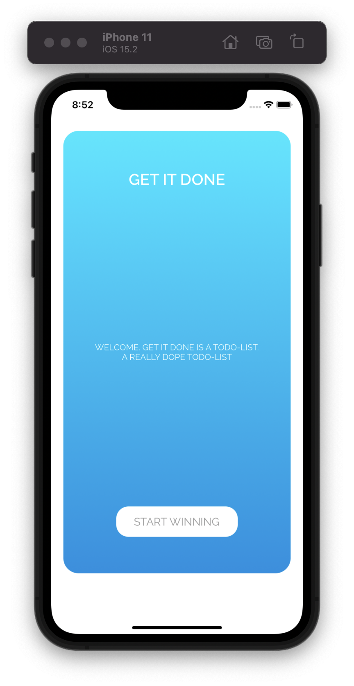
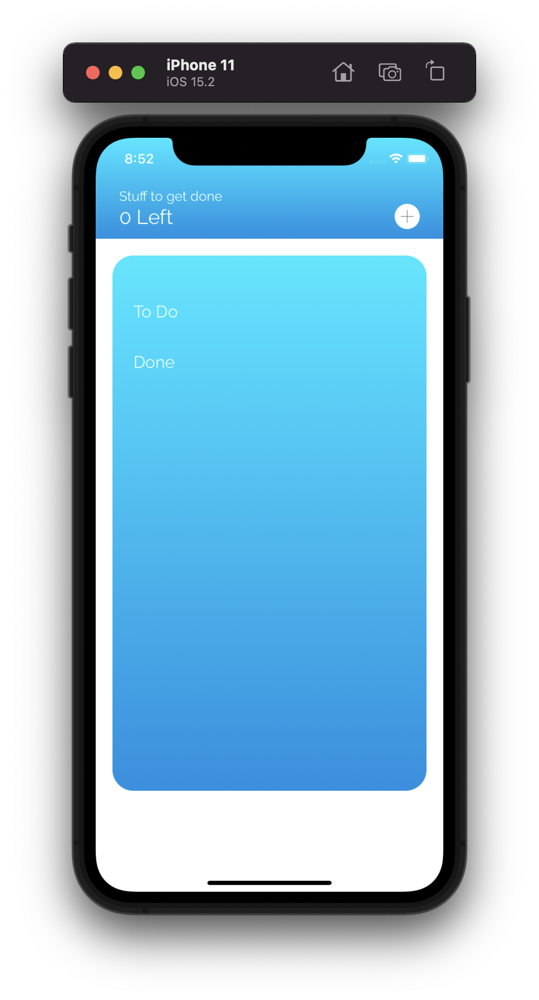
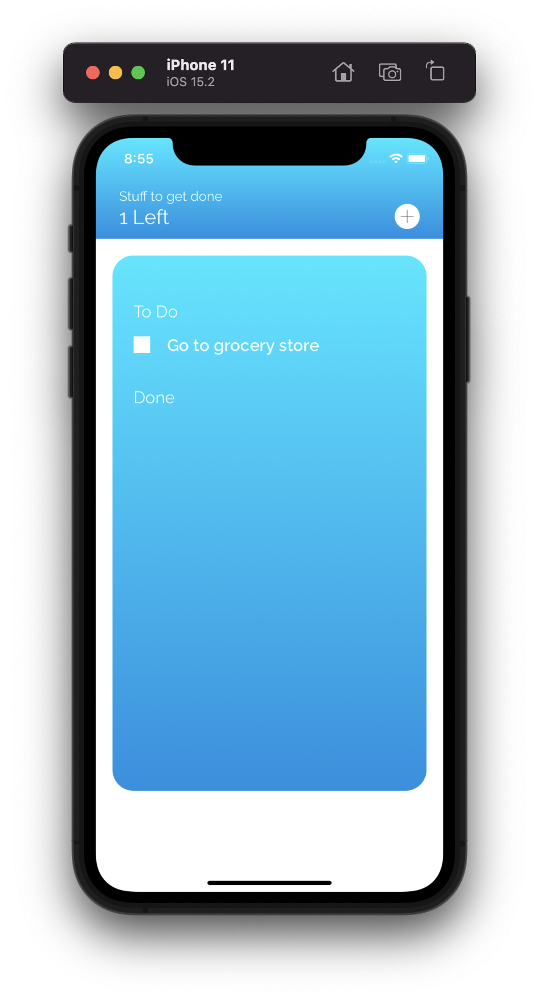
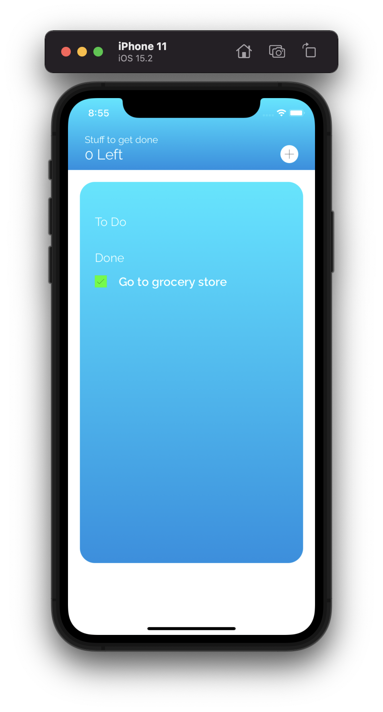
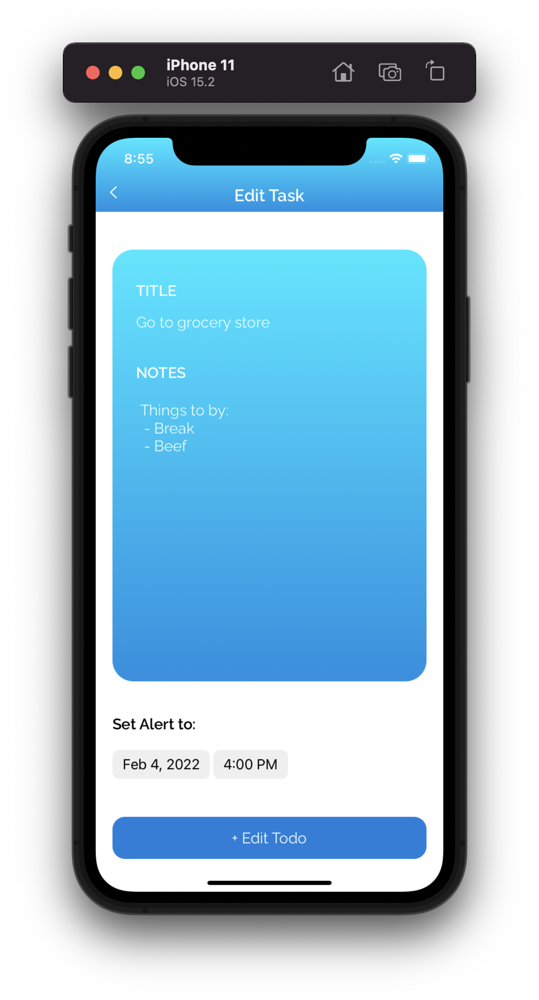
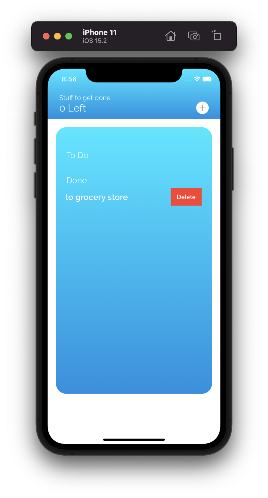

# GetItDone


## Introduction
For anyone who wants get be more organized and get stuff done, GetItDone is the perfect app for you.

## Features
* Add ToDo
* Check off ToDo as done
* Delete ToDo by swiping left

## Instulation
Simply copy this command into your terminal
```
  git clone https://github.com/Aldo10012/GitItDone.git
```

## How to use

1. download and open app. Click "Start Winning"

2. Now the app is open! You will have an empty screen at first. To add toDo's just start with clicking the white + box on the top right

3. A screen will present modaly. Type your todo title, notes, and select a due date. 

4. Congrats, you jsut added your first item. Feel free to add more

5. You can also click on the which check box next to your todo to mark it as done. 

6. If you tap on a task, you can edit it. 

7. If you want to delete a task to make room, just swipe left.

      
